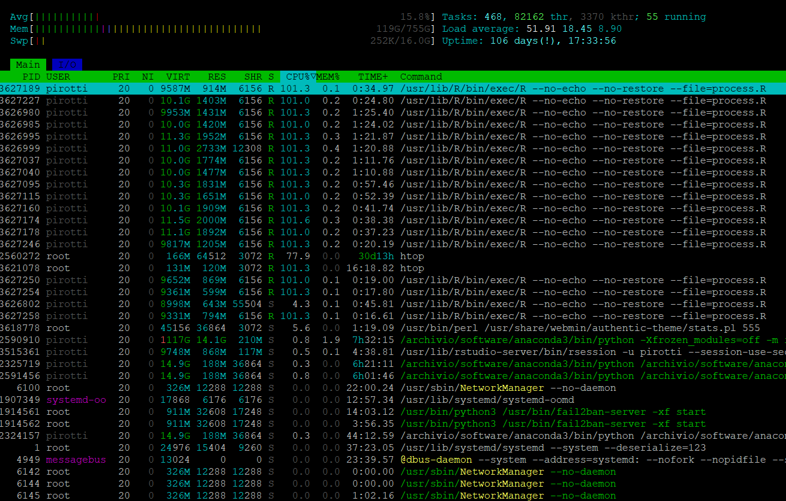

# lasRpipeline

Provides parallel processing using lidR for creating autoamatically topography, canopy fuel and fuel model raster from LAS files to support fire behaviour modelling. Objective is to make it as simple as possible but checking for pitfalls in the process.

Required libraries are automatically checked for and installed if needed.

| **NB** - this pipeline assumes you have a [classified]{.underline} point cloud in a [projected]{.underline} coordinate system (no geographic polar coordinates), [with very limited noise]{.underline} points, so please use responsibly and provide a clean and classified point cloud.

**Parallelization** tested in Linux for now.



## Usage

The script is '***process.R***' in the R folder. Open process.R and to the end of the script change two lines as below:

```{r}
.....
.....
.....
## just define input  directory 
las_folder <- "/myfolderwithLASfiles"  
## run and check messages
process_plot(las_folder)

```

## Acknowledgements

Part of this work is supported by the Wildfire CE Interreg Project, grant number CE0200934.
